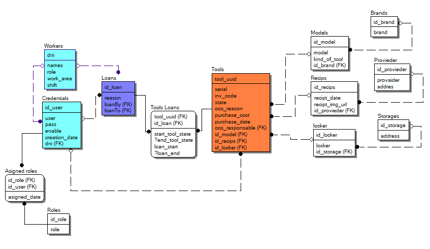

# Hola

## Dependencias
- cors
- dotenv
- bcryptjs
- mysql2
- -D nodemon

## base de datos

## Vistas hechas
- brands
- proevedores
- models `⚠️ este ultimo decidí hacerlo sin css o decoración porque quiero hacerlo funcionar antes de decorarlo `

## rutas 
- /api/marcas
- /api/asigroles
- /api/brand
- /api/model
- /api/credentials
- /api/loan
- /api/locker
- /api/provieder
- /api/receipts
- /api/roles
- /api/storages
- /api/tools
- /api/tool-loans
- /api/workers
